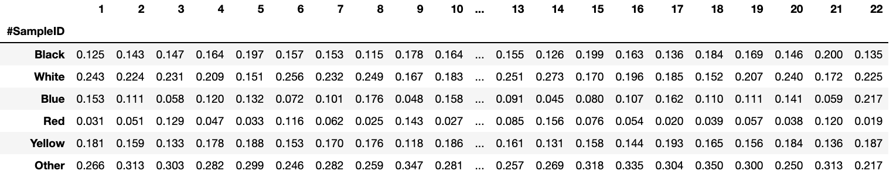
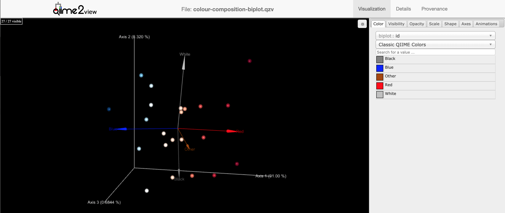
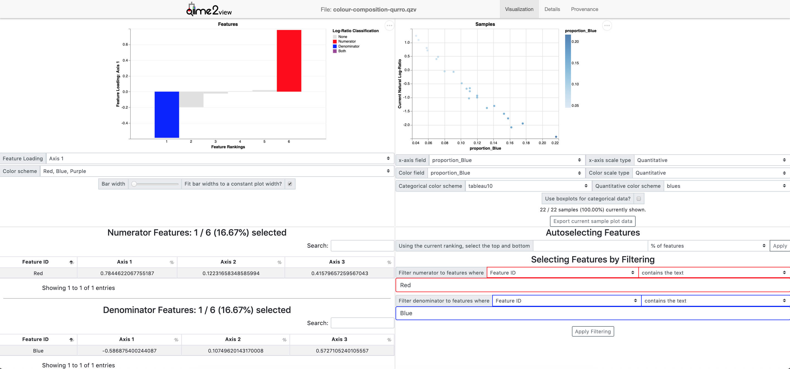

### Using Qurro with Other Data Types (pronounced churro)

Note: This tutorial assumes you have installed [DEICODE](https://github.com/biocore/DEICODE) and [Qurro](https://github.com/biocore/qurro). Optionally, QIIME2 can be installed and used following [these instructions](https://docs.qiime2.org/2019.10/install/). 

In many cases, input data may not be in the formats used in the microbiome field. Most data can easily be saved as tab-separated values (TSV) (see [here](https://en.wikipedia.org/wiki/Tab-separated_values) for a full description of tsv). In order to use Qurro, the tsv file must first be converted to biom format. The biom format stores only non-zero values prevening sparse data from overusing memory (see [here](http://biom-format.org/) for a full description of biom format).

As an example of how to convert and analyze data from other sources, we will follow the analysis of John Aitchison and  Michael Greenacre in “Biplots of compositional data” (Aitchison and Greenacre, 2002). In this analysis, we will use thier example of different paintings (samples) and the proportion of colors (features) used in each painting (table 1 in thier paper).



First, we will create a directory to store the data and a directory to store the results through the following commands:

```
mkdir data
mkdir results
```

The tsv format data and sample metadata can be downloaded following the commands:

- `colour-composition-data.tsv` | [download](https://github.com/biocore/qurro/tree/master/docs/tutorials/table-conversion-paintings/data/colour-composition-data.tsv) 
- `colour-composition-metadata.tsv` | [download](https://docs.qiime2.org/2019.4/data/tutorials/table-conversion-paintings/table.qza) 

From the compositional table of color proportions in the tsv format, we will first convert to biom format through the following command:

```
biom convert \
-i data/colour-composition-data.tsv \
-o data/colour-composition-data.biom \
--to-json
```

If we would like to use QIIME2 to analyze the data we can then run the following *optional* command:

```
qiime tools import\
--input-path data/colour-composition-data.biom\
--output-path data/colour-composition-data.qza\
--type 'FeatureTable[Frequency]'\
--input-format 'BIOMV100Format'
```

Next, following the analysis in the paper, we can perform Aitchison PCA described in the paper through [DEICODE](https://github.com/biocore/DEICODE). 

*with standalone*
```
deicode rpca\
    --min-feature-count 0\
    --min-sample-count 0\
    --in-biom data/colour-composition-data.biom\
    --output-dir results/rpca
```

*with QIIME2*
```
qiime deicode rpca\
--p-min-feature-count 0\
--p-min-sample-count 0\
--i-table data/colour-composition-data.qza\
--o-biplot results/rpca-biplot.qza\
--o-distance-matrix results/rpca-distance.qza
```

Next to visualize the ordination we can use [EMPeror](https://biocore.github.io/emperor/):
```Note: this step is available in QIIME2 only. ```

*with QIIME2*
```
qiime emperor biplot\
--i-biplot results/rpca-biplot.qza\
--m-sample-metadata-file data/colour-composition-metadata.tsv\
--o-visualization results/colour-composition-biplot.qzv
```

The results of the biplot produced by DEICODE match the example in the original paper. We can see that the ratio of blue and red differentiate paintings along the first axis. Additionally, we can also see that the ratio of white and black differentiate paintings along the second axis.



We can explore the log-ratios based on the axis loadings from the biplot using Qurro through the following command:

*with standalone*
```
qurro\
--ranks results/rpca/ordination.txt\
--table data/colour-composition-data.biom\
--sample-metadata data/colour-composition-metadata.tsv\
--output-dir results/qurro
```

*with QIIME2*
```
qiime qurro loading-plot\
--i-ranks results/rpca-biplot.qza\
--i-table data/colour-composition-data.qza\
--m-sample-metadata-file data/colour-composition-metadata.tsv\
--o-visualization results/colour-composition-qurro.qzv
```



In this example, we have toggled the highest loaded features being the numerator as the color red and the denominator as the color blue (left; rank bar plot). Then the log-ratio of red/blue is plotted on the y-axis of the right scatter plot, which can be colored and sorted by the proportion of blue in each painting. From this, we observe an inverse relationship as expected. 


#### References

Aitchison, J., and Greenacre, M. (2002). Biplots of compositional data. J. R. Stat. Soc. Ser. C Appl. Stat. 51, 375–392.
